<div style="display: flex; justify-content: center; align-items: center; flex-direction: column;">
    <br>
    
    <hr/>
    <p>
      
    </p>
    <p style="text-align: center">
        Um projeto da criação de uma API utilizando <a href="https://spring.io/projects/spring-boot">Spring Boot</a> 
        junto do seu consumo em uma aplicação <a href="https://flutter.dev">Flutter</a> utilizando MySql como o banco 
        de dados.

```mermaid
flowchart TD
    1[Aguardando agendamento] --> 2[Aguardando atendimento]
    2 -->|Problema identificado| 3[Aguardando orçamento]
    2 -->|Sem defeito| 3.1["Sem defeito (fim)"]
    2 -->|Cancelado| 3.2["Cancelado (fim)"]
    
    3 --> 4[Aguardando aprovação do cliente]
    4 -->|Não aprovado| 5.1["Não aprovado pelo cliente (fim)"]
    4 -->|Compra| 5.2["Compra (fim)"]
    4 -->|Aprovado| 5.3[Orçamento aprovado]
    
    5.3 --> 6[Aguardando cliente retirar]
    6 -->|Não retira há 3 meses| 7.1[Não retira há 3 meses]
    6 -->|Garantia| 7.2[Garantia]
    
    7.2 -->|Cortesia| 8[Cortesia]
    7.2 -->|Resolvido| 9["Resolvido (fim)"]
    8 --> 9["Resolvido (fim)"]
    7.1 --> 9["Resolvido (fim)"]
```

    </p>
</div>

<hr/>



---

## 🚀 Overview

This project provides a clean, extensible base for secure user authentication and session handling in modern mobile and web applications.

It supports:

- ✅ User **registration** and **login**
- 🔁 **Access** and **refresh tokens** (JWT)
- 🍪 Secure, HttpOnly **cookie-based refresh tokens**
- 🔒 Role-based authorization
- ⚙️ **Token auto-refresh** on the Flutter client using Dio interceptors
- 📄 Full **Swagger** API documentation

---

## 🏗️ Architecture

### **Backend — Spring Boot**

**Layers:**

| Layer            | Description                                                               |
|------------------|---------------------------------------------------------------------------|
| `presentation`   | Defines REST endpoints (e.g., `/auth/login`, `/auth/register`)            |
| `service`        | Contains business logic for authentication, token validation, and refresh |
| `domain`         | Holds entities, DTOs, and core domain logic                               |
| `infrastructure` | Manages JWT generation/validation, persistence, and configuration         |
| `swagger`        | Contains documentation interfaces using OpenAPI annotations               |

**Tech stack:**

- Spring Boot 3
- Spring Web
- Spring Security (custom implementation)
- JJWT (JSON Web Token library)
- Lombok
- OpenAPI/Swagger

---

## 🔄 Authentication Flow

```text
   ┌────────────────┐       ┌────────────────┐        ┌───────────────┐
   │  FrontEnd App  │──────▶│   /auth/login  │───────▶│  AuthService  │
   └──────┬─────────┘       └────────────────┘        └───────┬───────┘
          │                         │                         │
          │<─────── accessToken + refreshToken (cookie) ──────┘
          │
   Access token expires
          │
          ├───▶ Sends request with expired token
          │         │
          │         ├──401 Unauthorized
          │         │
          ├──▶ TokenRefreshInterceptor intercepts
          │         │
          ├──▶ Calls /auth/refresh using cookie
          │         │
          ├──▶ Receives new access token
          │         │
          └──▶ Retries the original failed request transparently
````

---

## ⚙️ Environment Variables

| Key                             | Description                  |
|---------------------------------|------------------------------|
| `MYSQL_USERNAME`                | Username that the mysql uses |
| `MYSQL_PASSWORD`                | Password that the mysql uses |
| `DB_HOST`                       | Database host                |
| `DB_PORT`                       | Database running port        |
| `DB_NAME`                       | Database name                |
| `JWT_TOKEN_SECRET`              | Secret key for signing JWTs  |
| `JWT_TOKEN_EXPIRATION_TIME`     | Access token lifetime in ms  |
| `REFRESH_TOKEN_EXPIRATION_TIME` | Refresh token lifetime in ms |

---

## 📘 Swagger Documentation

Once the backend is running, visit:

**[http://localhost:8080/swagger-ui.html](http://localhost:8080/swagger-ui.html)**

You can test:

* Register / Login / Refresh / Logout directly from Swagger UI
* View detailed request/response schemas (powered by `AuthSwagger`)

---

## 🧩 How to Run

### Backend

```bash
./mvnw spring-boot:run
```

## 💡 Design Principles

* **DDD-aligned structure:** separates domain logic from technical details
* **Single-responsibility services:** Auth logic lives in `AuthService`
* **Extensible token layer:** `ITokenVerifier` and `ITokenGenerator` abstractions allow future switch to different providers (e.g., OAuth2)

---

## 🧠 Future Improvements

* Add user roles & permissions (e.g., ADMIN, TECHNICIAN, CLIENT)
* Integrate OpenTelemetry tracing for login and refresh events

---

## 👤 Author

**Lucas Bonato**
Software Engineer & Flutter Developer
📧 [lucas.perez.bonato@gmail.com](mailto:lucas.perez.bonato@gmail.com)